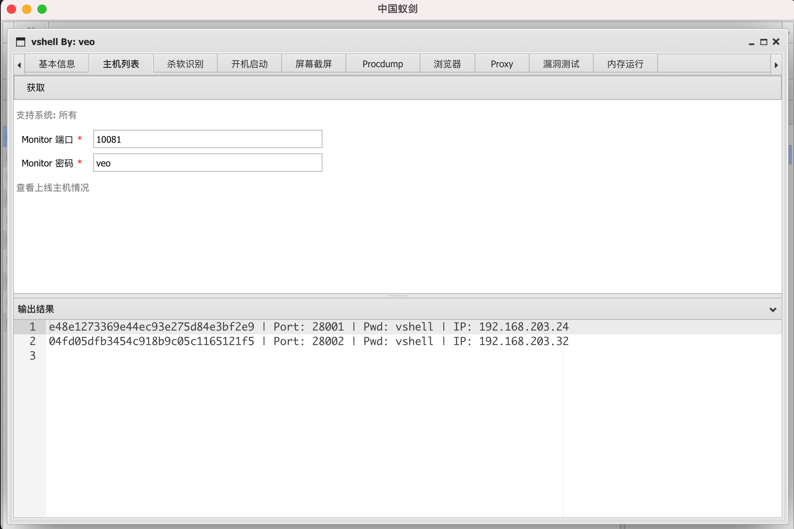
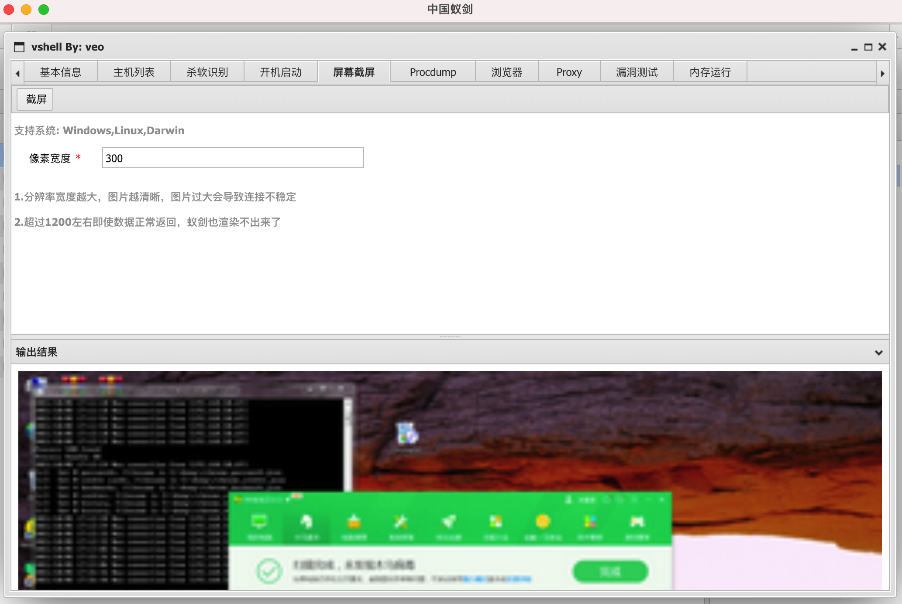

# vshell

[English](https://github.com/veo/vshell/blob/main/README_en.md)

vshell 是一款go编写的主机管理工具

使用蚁剑控制台及插件管理主机

基本框架为

client <-> teamserver <-> 蚁剑

蚁剑连接类型 CUSTOM，如乱码编码类型可选GBK

# Options
## client
```
-PWD                    PassWord (default "vshell")
-RHOST                  Team Server IP (default "255.255.255.255")
-RPORT                  Team Server Port (default "10080")

```
## teamserver

```
-LPORT                  Listen PORT (default 10080)
-MINPORT                MinAccess Port (default 28000)
-MPORT                  Monitor Port (default 10081)
-MPWD                   Monitor PassWord (default "veo")

```

# 功能：

## 1.蚁剑马的所有已有功能

文件上传/下载、命令执行、数据库操作、修改文件时间戳等

数据库只支持mysql，支持太多会导致客户端文件太大，其他数据库请用代理连接

## 2.蚁剑插件




## 3.参数隐藏、进程名隐藏（除windows）
进程的参数和名字都会被隐藏，防止被简单的溯源teamserver IP，darwin下整个进程会被隐藏


# Q/A

1.如何不用参数启动程序，适用于钓鱼等场景?

A.查看 replaceteamserverip.sh 你就明白了，TeamServer IP地址被我硬编码在程序里了，直接修改硬编码即可，但RPORT和PWD都只能能使用默认不能硬编码修改

2.为什么不放出免杀的版本

A.功能越多，越不容易免杀，在加了内存执行功能以后就很难免杀了。我可能有一些免杀的方法，但是我放出来以后大家用了估计很快就不免杀了，因此，我上传了原程序没加过壳的，方便大家使用shellcodeLoad或者加壳