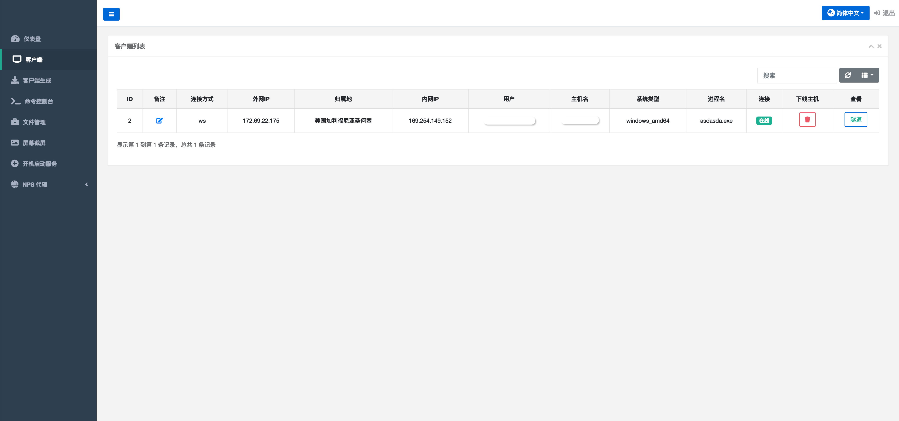
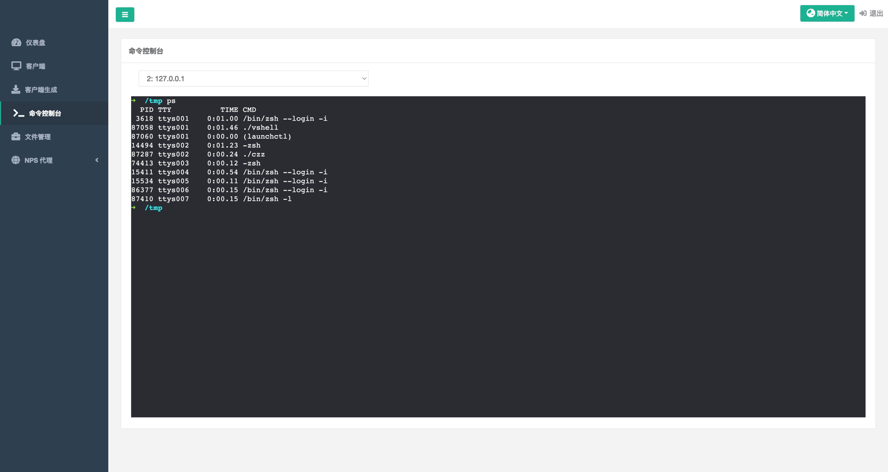
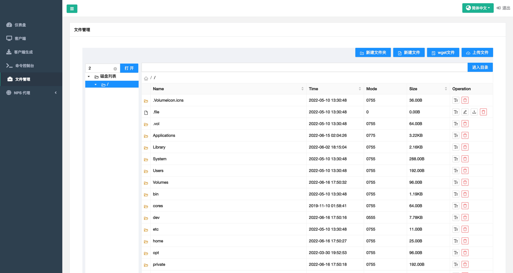
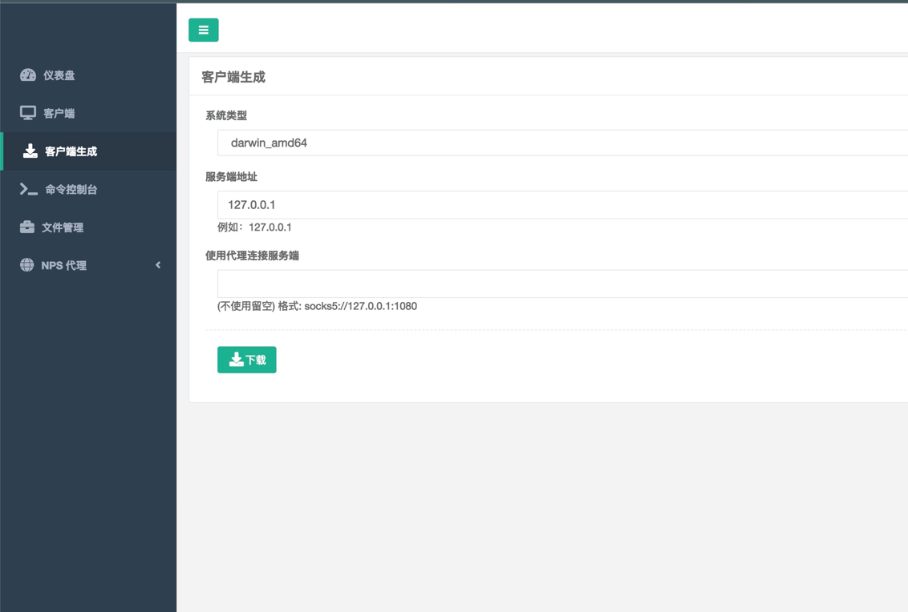

# vshell 3.0 
**CobaltStrike难用？来试试vshell吧**


vshell 是一款go编写的主机群管理工具（RAT）

# 改动
1.之前版本是自写协议，但有众多问题不稳定容易掉线。后续彻底放弃采用 [NPS](https://github.com/ehang-io/nps) 的协议，现在已经非常稳定不会掉线，

2.现在支持TCP，UDP/KCP 协议上线

3.逐步弃用蚁剑连接的方式，直接使用web管理主机，目前还可以使用蚁剑连接 （注意：蚁剑连接类型 CUSTOM，如乱码编码类型可选GBK）


# WEB界面

# 功能：

## 1.Vshell功能
```
1.文件管理
2.交互式虚拟终端，Linux、MacOS、Windows都支持交互
3.旧版vshell蚁剑连接的功能
功能陆续添加中...
```




## 2.NPS代理功能
```
支持NPS的所有已有的功能
```

## 3.服务端直接生成客户端

可以使用服务端直接生成客户端，客户端不需要任何参数和配置文件即可运行
