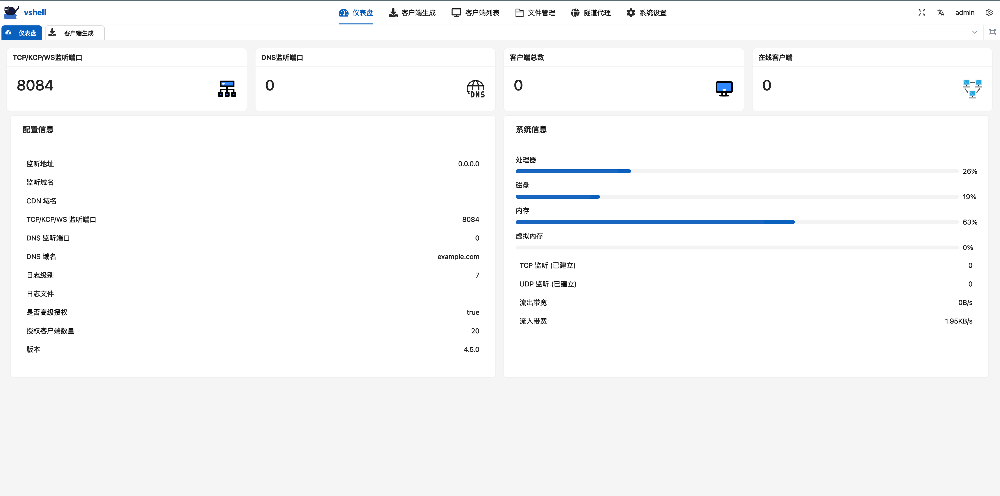

<h1 align="center">
  
  <br>
  <p align="center">VSHELL</p>
</h1>
<p align="center">安全对抗模拟、红队工具</p>

<p align="center">
<a href="https://github.com/veo/vshell/issues"></a>
<a href="https://github.com/veo/vshell/releases"></a>
<a href="https://github.com/veo/vshell/releases"></a>
</p>

# :warning:Warning

### :warning: 1. vshell 已无限期停止在 github 公开更新和发放试用授权。具体情况可阅读 [说明](WARNING.md)

### :warning: 2. 近期收到有关于 “vshell破解版” 在外流通的消息。请各位仔细甄别，文件有可能被被恶意投毒，导致您的利益受到损害。

### :warning: 3. 我反对破解行为，但我更反对使用以宣传 “vshell破解版” 进行盈利的非法行为。请各公众号、知识星球等立即停止对 “vshell破解版” 的宣传。过程中如存在任何非法行为，作者不知情也不承担任何法律及连带责任。

### :warning: 4. vshell是一款需要身份授权软件，如果您是一名正义的安全从业人员，有业务需要使用这款软件可以想办法联系我，不要自己尝试去任何第三方渠道获取破解资源。


# Features

<h1 align="center">
  
  <br>
</h1>


<h2>为什么选择 vshell</h2>

vshell 为您提供隧道代理和隐蔽通道，以模拟网络中的持久化攻击行为。支持多种协议、高兼容性、及强大的协作能力，帮助蓝队更好的评估安全设备水平，提高应急响应能力

<h2>产品功能</h2>

vshell 被广泛用于红蓝攻防演练演练和对抗模拟中，模拟长期潜伏攻击者的策略和技术。

```
1.支持多种协议的隐蔽通道（TCP、UDP/KCP、WebSocket、DNS、DOH、DOT）
2.支持文件管理、终端、屏幕截屏、开机启动等管理功能
3.支持内存运行多种格式的插件（exe、.net、elf、dll、so、dylib）
4.支持多种协议的隧道代理
5.支持正、反向连接模式，支持代理上线
6.支持Windows shellcode客户端
7.支持域名上线、CDN上线
8.支持ebpf客户端穿透防火墙 (演示视频：https://www.bilibili.com/video/BV1Vw411t78a)
```


<h2>使命</h2>

缩小渗透测试工具和高级威胁恶意软件之间的差距。

<h2>愿景</h2>

通过合法合规的攻防演练、红蓝对抗：

- (1) 培养高水平的安全工程师
- (2) 推动网络安全水平的进步
- (3) 向安全专业人员提供高级威胁策略和培训

<h2>法律合规声明</h2>

vshell致力于通过合法、合规、负责任、符合道德的方式执行自身使命和愿景。

为履行这一承诺：

- (1) 制定了明确的产品控制限制
- (2) 会仔细审查客户身份和每项产品需求，以确保遵守法律


<h2>产品控制声明</h2>

从功能上来说，vshell和它模拟的高级威胁恶意软件行为一样，随着互联网传播，此产品的双重功能成为了一个挑战。vshell的目标是确保成为一股为安全专业人员提供支持的正义力量。

为实现这一目标，制定了一些流程和限制措施：

- (1) 仅将正式版产品交给仅将产品用于合法合规渗透测试目的的安全专业人员
- (2) 限制客户端数量、限制高级功能，降低对非法从业者的吸引力
- (3) 使用许可证防止产品不受限制的扩散


