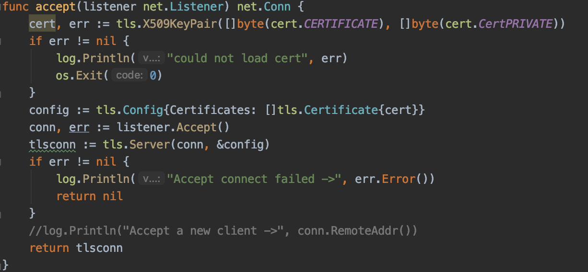
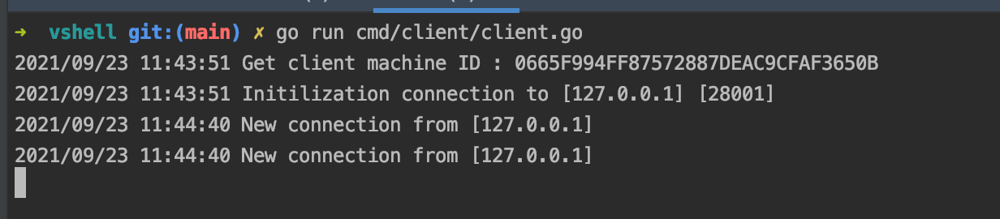
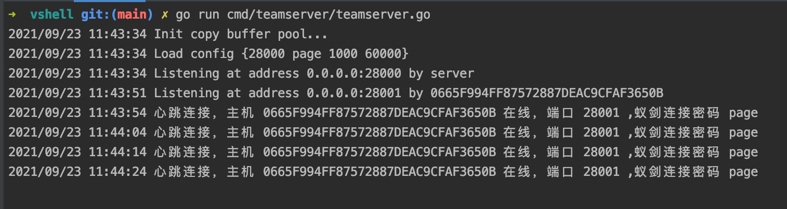
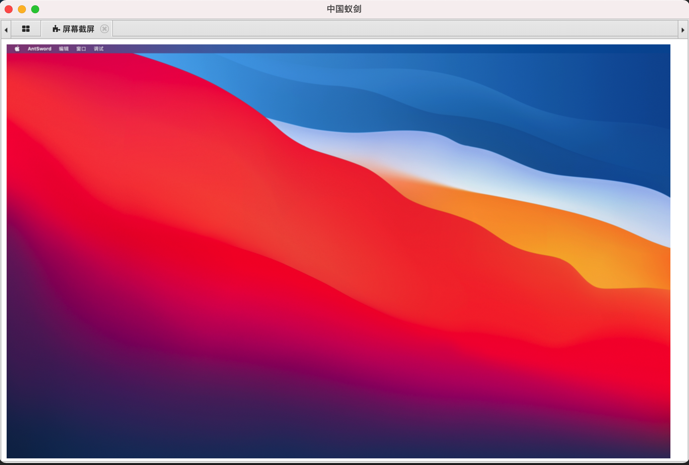
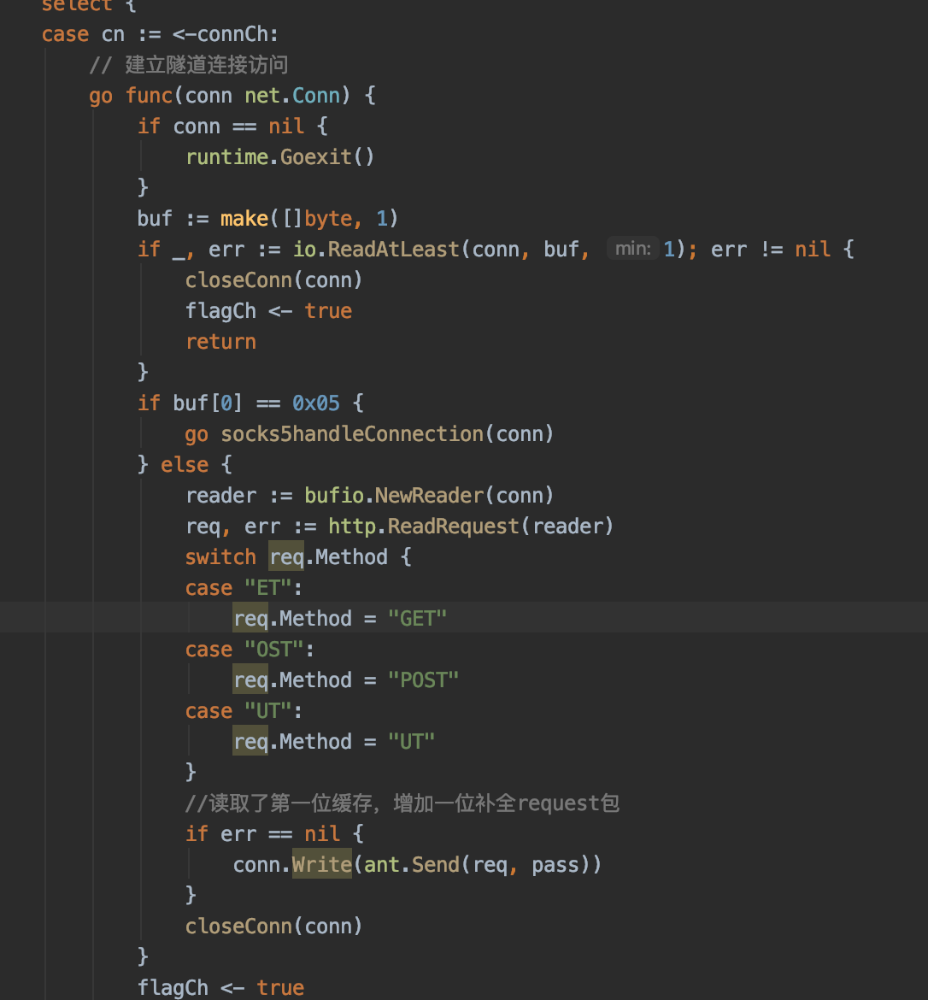
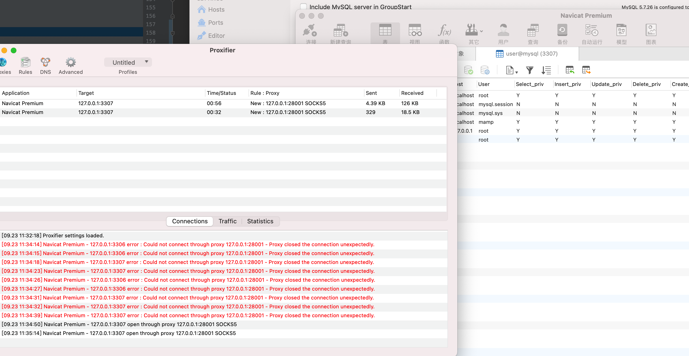
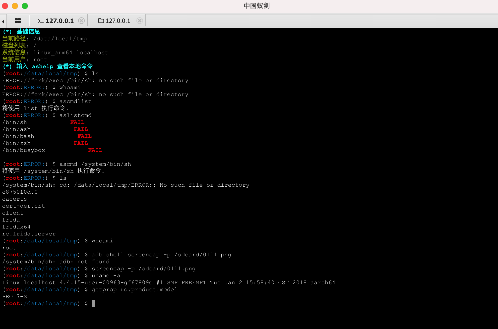
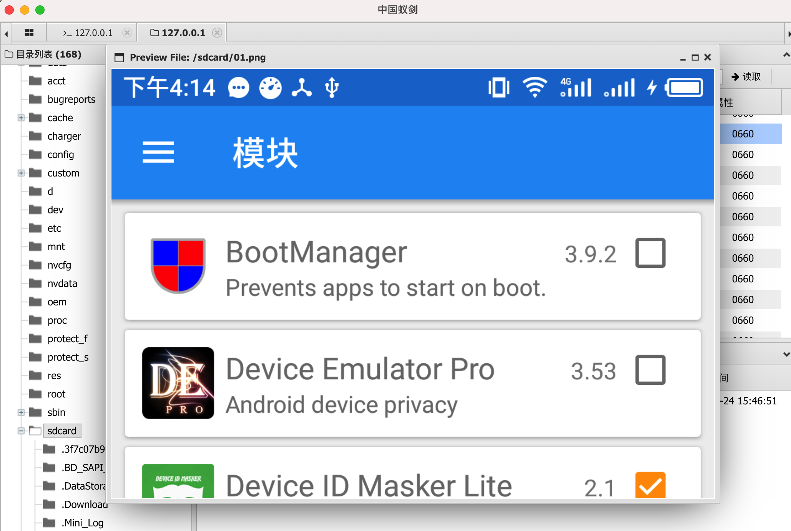

# vshell
vshell 是一款go编写的rat 

文件都是二进制的，只是拿蚁剑进行主机控制

基本框架为

client <-> teamserver <-> 蚁剑

目前仅支持 TCP TLS反连上线的模式


client


teamserver


# Options
## client
```
-RHOST                  Team Server IP (default "127.0.0.1")
-RPORT                  Team Server Port (default "10080")
-PWD                    PassWord (default "veo")
```
## teamserver

```
-LPORT                  Listen PORT (default 10080)
-PWD                    PassWord    (default "veo")
-MINPORT                MinAccess Port  (default 28000)
-MAXPORT                MaxAccess Port  (default 29000)
```
# Note
client 和 teamserver 通过 PWD 进行鉴权，这个密码同样是蚁剑的连接密码

蚁剑选择 CUSTOM 连接类型

socks5代理需要设置账号密码进行连接，账号密码都是蚁剑密码

其他功能因为还没写蚁剑插件，暂时用不了

# 功能：

## 1.蚁剑马的所有已有功能

文件上传/下载、命令执行、数据库操作、修改文件时间戳等

命令执行


文件操作


数据库操作（只支持mysql，支持太多会导致客户端文件太大，其他数据库请用代理连接）


## 2.屏幕截屏（配合插件）


## 3.端口复用，上线即代理

机器上线会在teamserver创建一个端口，这个端口既是蚁剑的连接端口，又是socks5代理端口（花了很久的时间才完成的端口复用）

且teamserver和client的连接都是TLS加密的，自然socks5的包也会被加密






## 4.交互式shell（感觉没有太大作用又影响稳定性，被阉割了）

同样是端口复用，teamserver创建的端口也可以进行交互式shell

直接使用nc 连接端口，然后输入连接的密码，密码正确就可以得到一个交互式的shell


## 5.获取LSASS进程文件，导入mimikatz（配合插件）

https://github.com/calebsargent/GoProcDump

## 6.开机启动添加（配合插件）
https://github.com/takama/daemon


## 7.参数隐藏（进程名隐藏）（除windows）

进程的参数和名字都会被隐藏，防止被简单的溯源teamserver IP

darwin下甚至整个进程会被隐藏

## 8.甚至，你可以使用蚁剑控制手机


