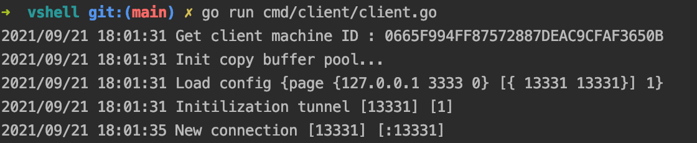
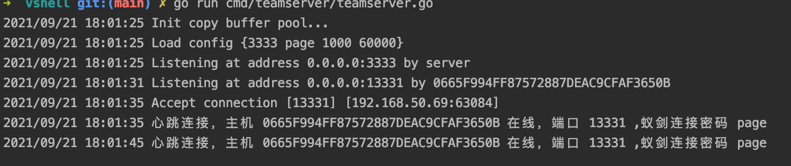
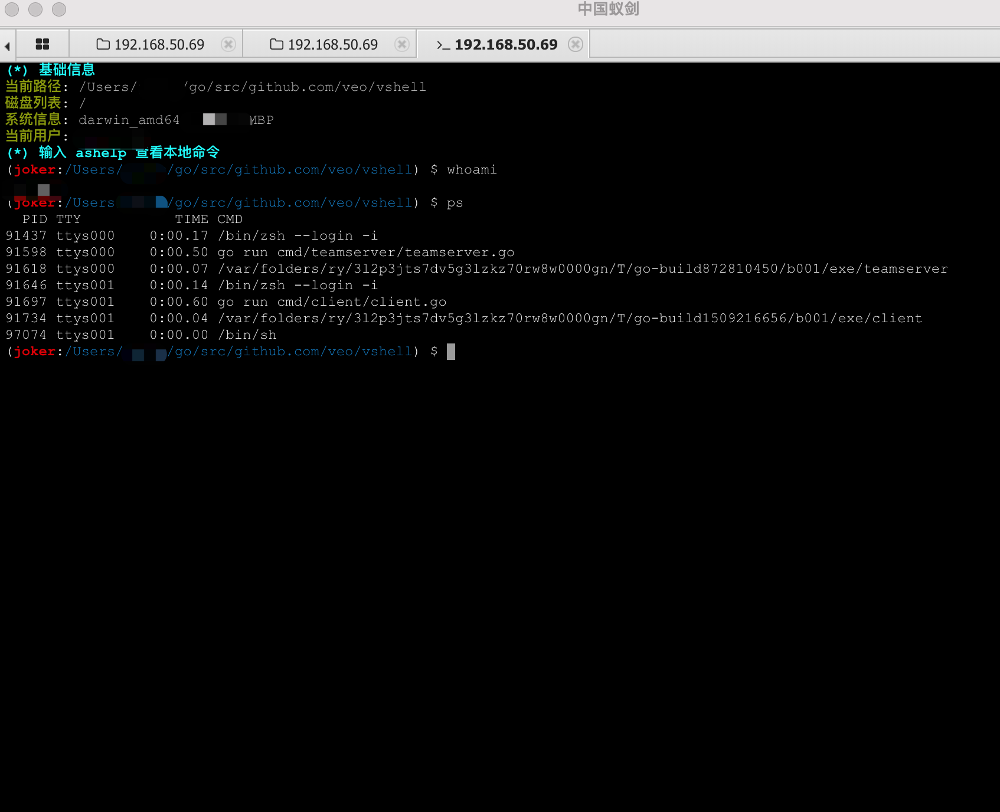
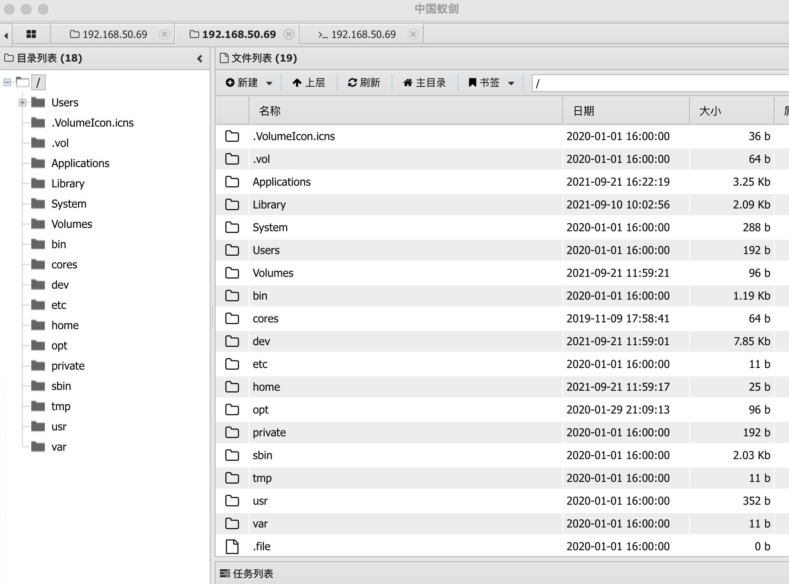
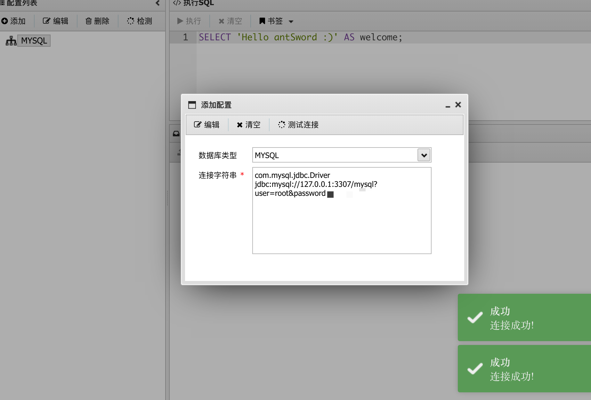
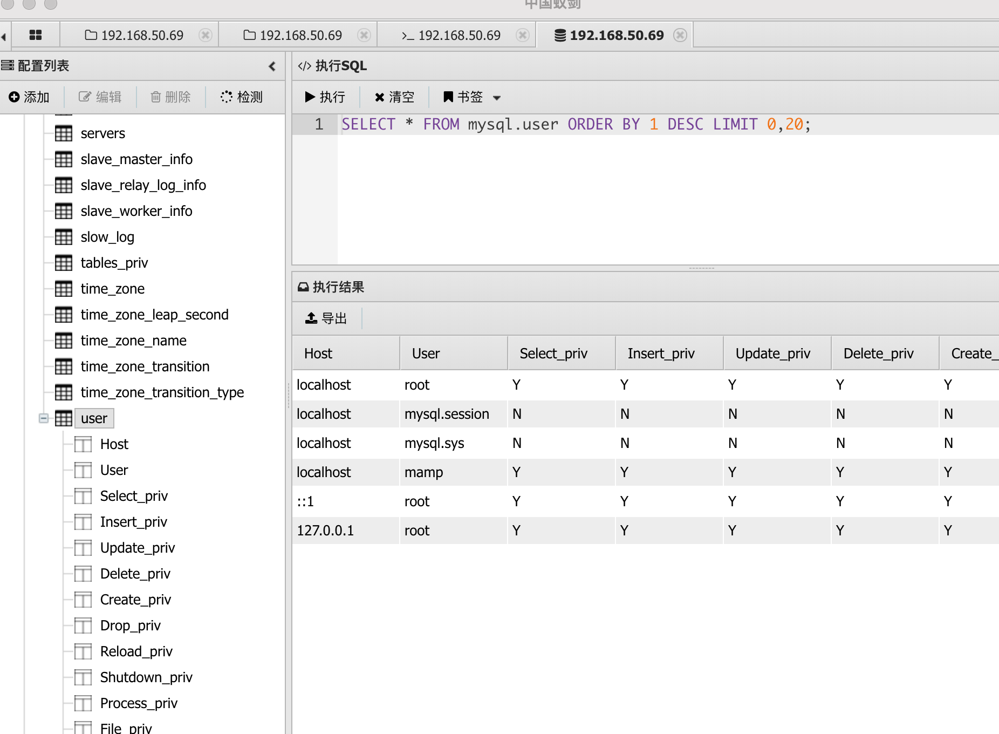
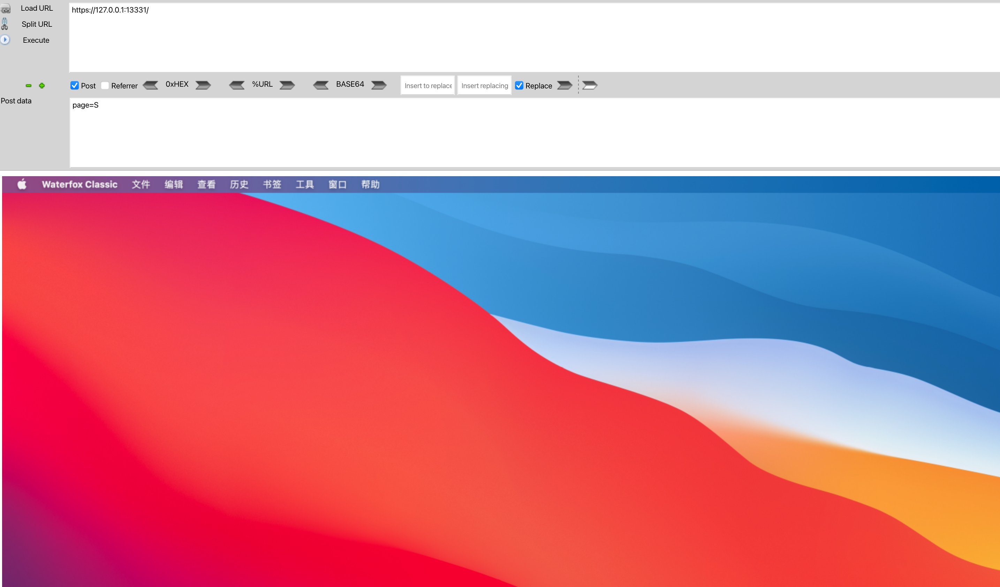

# vshell
vshell 是一款go编写的rat 

文件都是二进制的，只是拿蚁剑进行主机控制

基本框架为

client <-> teamserver <-> 蚁剑

目前仅支持 TCP TLS反连上线的模式

client

teamserver

功能：
1.蚁剑马的所有已有功能（文件上传/下载、命令执行、数据库操作、修改文件时间戳等。。。）
命令执行

文件操作

数据库操作

2.屏幕截屏

3.获取LSASS进程文件，导入mimikatz

目前就写了这么多