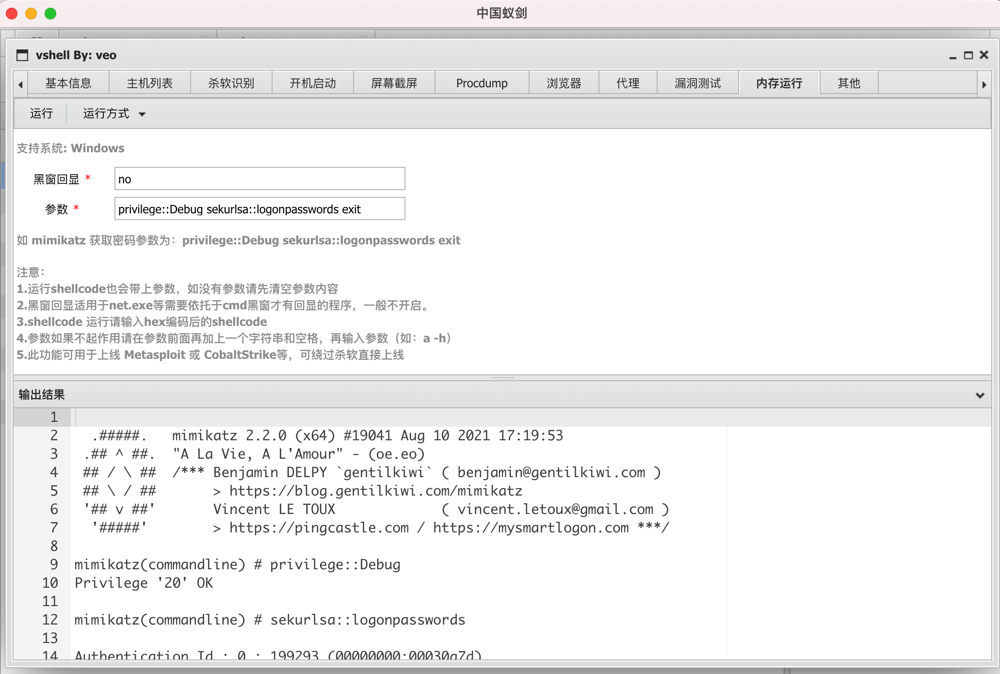

# vshell

[English](https://github.com/veo/vshell/blob/main/README_en.md)

vshell 是一款go编写的主机群管理工具（RAT）

使用蚁剑控制台及插件管理主机

基本框架为

client <-> teamserver <-> 蚁剑

蚁剑连接类型 CUSTOM，如乱码编码类型可选GBK

# Options
## client
```
-PWD                    PassWord (default "vshell")
-RHOST                  Team Server IP (default "255.255.255.255")
-RPORT                  Team Server Port (default "10080")

```
## teamserver

```
-LPORT                  Listen PORT (default 10080)
-MINPORT                MinAccess Port (default 28000)
-MPORT                  Monitor Port (default 10081)
-MPWD                   Monitor PassWord (default "veo")

```

# 功能：

## 1.蚁剑控制台所有已有功能
```
1.文件上传/下载
2.文件复制/粘贴/预览/新建/删除
2.控制台编辑文件
3.虚拟终端
4.数据库操作（暂时只支持mysql）
5.修改文件时间戳
6.WGET下载
...
```


## 2.蚁剑插件 vshell
```
1.基本信息
2.主机列表
3.杀软识别
4.开机启动服务管理
5.屏幕截图
6.Procdump
7.浏览器数据获取
8.socks5代理（上线即代理，不需要额外配置）
9.漏洞测试
10.内存运行（支持exe和shellcode两种模式，支持内存上线 Metasploit 或 CobaltStrike等，支持运行mimikatz）
11.管道仿冒技术提权（msf 中的 getsystem）
12.卸载vshell
```




## 3.后台运行
在linux和darwin系统下，不需要使用nohup即可后台运行

## 4.参数隐藏、进程名隐藏
在linux和darwin系统下，vshell的参数会自动隐藏，不需要担心会被ps或其他任务管理器看到

## 5.代码混淆
经过混淆每次生成的代码都不一样，所以可以较为轻松的通过静态查杀

# 钓鱼场景

Q.如何不用参数启动程序，适用于钓鱼等场景?

A.查看 replaceteamserverip.sh 你就明白了，TeamServer IP地址被我硬编码在程序里了，直接修改 client_windows_amd64_notupx.exe 的硬编码即可，但RPORT和PWD都只能能使用默认不能硬编码修改，修改完以后就不需要参数直接双击即可启动程序，可以修改完再加upx缩小体积
