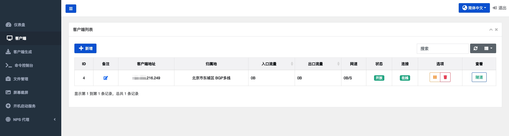
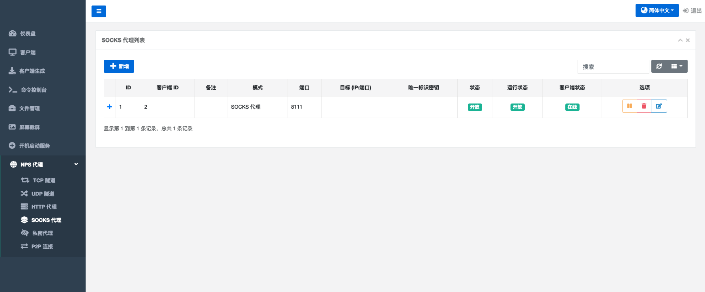
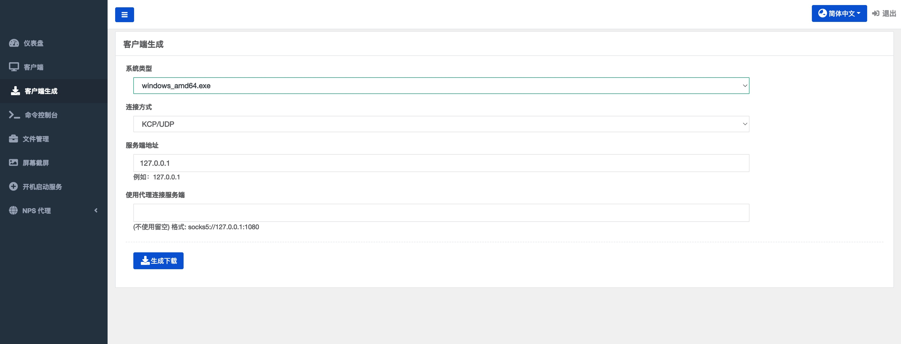

# vshell

vshell 是一款go编写的主机群管理工具（RAT）

## 流量
支持TCP，UDP/KCP 协议

通讯默认使用tls证书进行加密

## Features


### 1.管理功能
```
1.文件管理
2.交互式虚拟终端，Linux、MacOS、Windows都支持交互
3.屏幕截屏
4.添加开机启动
...
```


### 2.NPS代理功能

支持NPS的所有已有的代理功能，直接在WEB端设置代理即可


### 3.服务端直接生成客户端
可以使用服务端直接生成客户端，客户端不需要任何参数和配置文件即可运行



# Licenses
本工具仅面向合法授权的企业管理行为，在使用本工具进行主机管理时，您应确保该行为符合当地的法律法规，并且已经取得了足够的授权。

如您在使用本工具的过程中存在任何非法行为，您需自行承担相应后果，作者将不承担任何法律及连带责任。

在使用本工具前，请您务必审慎阅读、充分理解各条款内容，限制、免责条款或者其他涉及您重大权益的条款可能会以加粗、加下划线等形式提示您重点注意。 除非您已充分阅读、完全理解并接受本协议所有条款，否则，请您不要使用本工具。您的使用行为或者您以其他任何明示或者默示方式表示接受本协议的，即视为您已阅读并同意本协议的约束。


# 安恒星火实验室

<h1 align="center">
  
  <br>
</h1>
专注于实战攻防与研究，研究涉及实战攻防、威胁情报、攻击模拟与威胁分析等，团队成员均来自行业具备多年实战攻防经验的红队、蓝队和紫队专家。本着以攻促防的核心理念，通过落地 ATT&CK 攻防全景知识库，全面构建实战化、常态化、体系化的企业安全建设与运营。


**目前实验室有岗位在招，实验室位于广州白云，期待您的参与**

简历投递邮箱：MHg3ODc3Njg2ZjYxNmQ2OTQwNjY2Zjc4NmQ2MTY5NmMyZTYzNmY2ZA==
