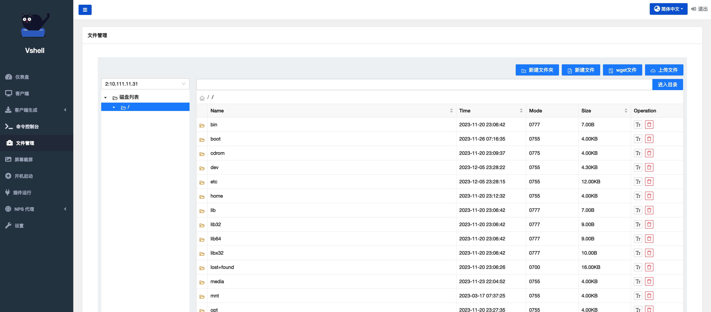
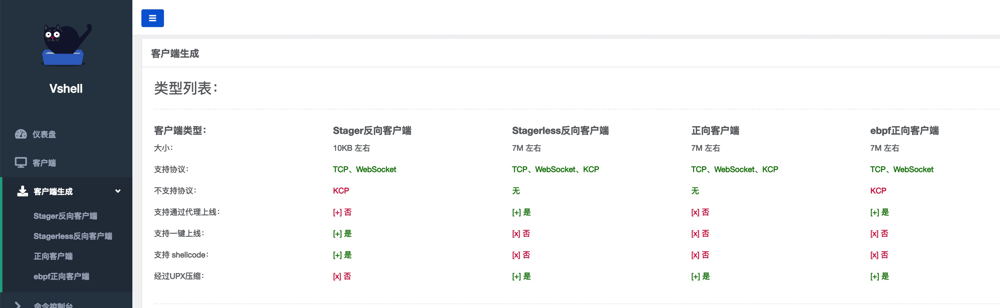
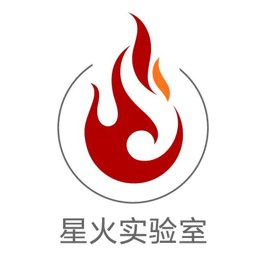

<h1 align="center">
  
  <br>
</h1>
<p align="center">vshell 是一款主机群管理工具（C2）</p>

<p align="center">
<a href="https://github.com/veo/vshell/issues"></a>
<a href="https://github.com/veo/vshell/releases"></a>
<a href="https://github.com/veo/vshell/releases"></a>
</p>

# Features

<h1 align="center">
  </a>
  <br>
</h1>

### 1.特性
```
1.支持ebpf客户端的C2 (演示视频：https://www.bilibili.com/video/BV1Vw411t78a)
2.完美的交互式虚拟终端
3.无需编译环境，服务端直接生成客户端
4.无需特殊运行环境，服务端单一文件运行
5.支持Windows shellcode客户端
6.超快的代理功能
7.支持内存运行多种格式的插件（exe、.net、elf、dll、so、dylib）
8.支持WebSocket CDN中转
9.支持正、反向连接的客户端
10.支持代理上线、代理链
```


### 2.流量
支持TCP，UDP/KCP，WebSocket 协议

WebSocket 协议支持使用 CDN 中转

通讯默认使用自定义盐进行加密


### 3.管理功能
```
1.文件管理
2.交互式虚拟终端，Linux、MacOS、Windows都支持交互
3.屏幕截屏
4.自定义插件运行
5.添加开机启动
6.NPS代理
```




### 4.服务端直接生成客户端
可以使用服务端直接生成客户端，客户端不需要任何参数和配置文件即可运行

客户端支持四种类型，网页内含使用说明
```
Stager反向客户端
Stagerless反向客户端
正向客户端
ebpf正向客户端
```



客户端介绍


### 5.NPS代理功能

支持NPS的所有已有的代理功能，直接在WEB端设置代理即可


# Licenses
本工具仅面向合法授权的企业管理行为，在使用本工具进行主机管理时，您应确保该行为符合当地的法律法规，并且已经取得了足够的授权。

如您在使用本工具的过程中存在任何非法行为，您需自行承担相应后果，作者将不承担任何法律及连带责任。

在使用本工具前，请您务必审慎阅读、充分理解各条款内容，限制、免责条款或者其他涉及您重大权益的条款可能会以加粗、加下划线等形式提示您重点注意。 除非您已充分阅读、完全理解并接受本协议所有条款，否则，请您不要使用本工具。您的使用行为或者您以其他任何明示或者默示方式表示接受本协议的，即视为您已阅读并同意本协议的约束。

# 微信交流群


# 安恒星火实验室

<h1 align="center">
  
  <br>
</h1>
专注于实战攻防与研究，研究涉及实战攻防、威胁情报、攻击模拟与威胁分析等，团队成员均来自行业具备多年实战攻防经验的红队、蓝队和紫队专家。本着以攻促防的核心理念，通过落地 ATT&CK 攻防全景知识库，全面构建实战化、常态化、体系化的企业安全建设与运营。


