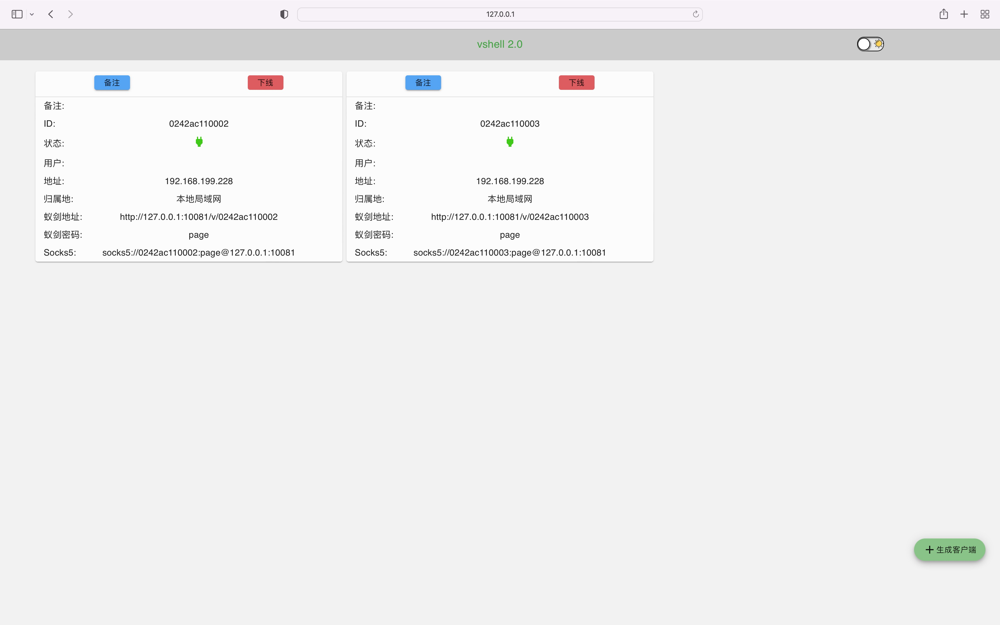
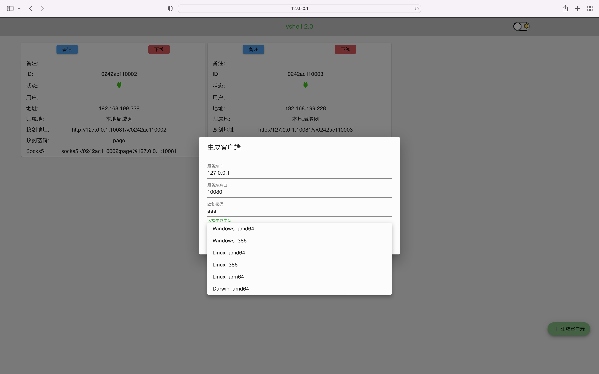
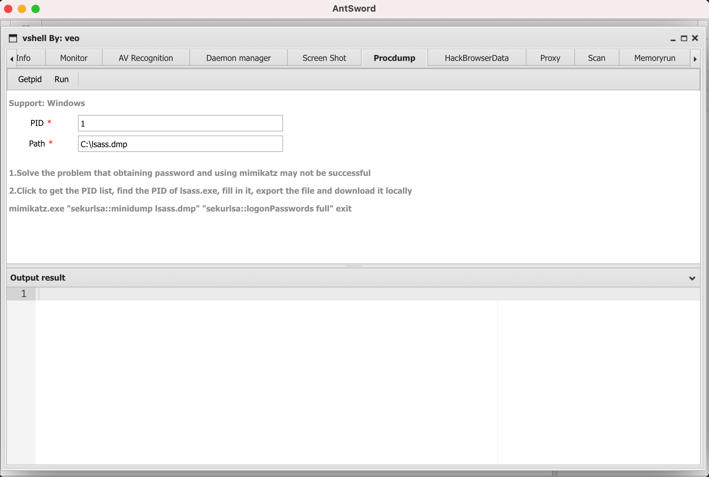

# vshell 2.0
**Is cobaltstrike hard to use? Let's try vshell**

vshell is a Remote Administation tool written in Go (RAT)

use [AntSword](https://github.com/AntSwordProject/antSword) control host

The basic framework is

client <-> vshell <-> AntSword

notes: AntSword Shell type choose CUSTOM

# Options
```
-LPORT                  Listen PORT (default 10080)
-WPORT                  Web Port (default 10081)
-USER                   Web User (default "admin")
-PWD                    Web Pass (default "vshell")
```

# WEB UI




# Function：

## 1.AntSword main function

File upload / download, command execution, database operation, modification of file timestamp, etc

The database only supports mysql. Too much support will cause the client file to be too large. For other databases, please use socks5 proxy to connect

## 2.AntSword Plugins

ScreenShot, Procdump, HackBrowserData, Memoryrun, socks5 Proxy, Service add


